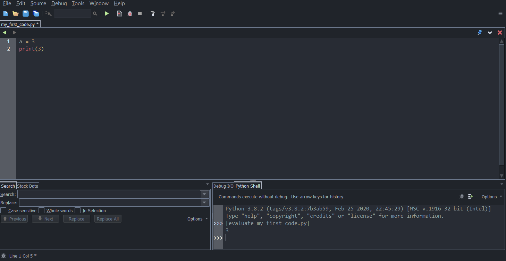

# Lesson 1: Variables and Output

## Table of Contents
  - [A few vocabulary terms you should know](#a-few-vocabulary-terms-you-should-know)
  - [Numbers and Basic Mathematical Operations](#numbers-and-basic-mathematical-operations)
  - [Variables](#variables)
  - [Output](#output)
  - [Exercise 1](#exercise-1)
  - [More Built-in Functions](#more-built-in-functions)
  - [Exercise 2](#exercise-2)

## A few vocabulary terms you should know

- The *syntax* of a language is like how the language is supposed to look, or, the "way we're allowed to express ideas". Think of it like English spelling and grammar: if it's incorrect, it's incomprehensible. Likewise, a syntax error in your code prevents your program from running as your computer doesn't know what it means.
  - The equivalent adverb is *syntactically* (e.g. *syntactically correct* means having correct syntax)
- *Semantics* is the "meaning of what we say". Semantic error occurs when an expression, though correct in terms of syntax, cannot be reduced to a value. For example, "The Sun digs hungrily" has correct syntax (spelling and grammar), but it makes no sense.
- A *data type* is a possible "type" of value that can be used for computation. Examples of data types include: 
  - **Numbers**. These can be separated into **integers** (such as 5, 0, -44, etc.) and **floats** (rational numbers such as 4.5, 0.1, -4.555, etc.). Note that an integer counts as a float as well.
  - **Strings**. These are sequences of characters (such as `"hello"`, `"python is cool"`, etc.). You will learn more about strings in-depth in a later lesson.
  
  You will learn more data types in later lessons.

## Basic Mathematical Operations

Let's start off by learning how to use the Python Shell.

We will start by learning how to use numbers and basic mathematical functions: `+` for addition, `-` for subtraction, `*` for multiplication, `/` for division. Type each of these lines below into the Python Shell and determine what is returned after each line is entered (Do not type the characters `>>>`, as those are just to tell you to input something in the shell. Do not type in the `_____` either, as those are just placeholders for the resulting values; just type in the mathematical expression that follows each `>>>`)

```python
>>> 3 + 5
_____
>>> 4 - 2
_____
>>> 4 * 8
_____
>>> 2 * 3 + 5
_____
>>> 2 + 3 * 5
_____
>>> 3 / 2
_____
>>> 2.2 * 3.3
_____
>>> (4 + 1) * 8
_____
```
Notice that the order of operations (BEDMAS) applies when computing these values.

Python also has three more operators:
1. **`x // y`** means "floor division". It calculates the **closest integer below or equal to `x / y`**. It is good to note that if `x` and `y` are positive, `x // y` means `x / y` but **without the remainder**. For example:
    ```python
    >>> 9 / 2
    4.5
    >>> 9 // 2
    4
    >>> -13 / 4
    -3.25
    >>> -13 // 4
    -4
    >>> 4 // 2
    2
    ```
2. **`x % y`**, known as `x` mod `y`, returns the remainder when `x` is divided by `y`. For example:
    ```python
    >>> 9 % 2
    1
    >>> 6 % 3
    0
    ```
3. **`x ** y`** means `x` raised to the exponent of `y`. For example:
    ```python
    >>> 3 ** 2
    9
    >>> 4 ** -2
    0.0625
    ```

A **string** is a "sequence of characters" that, in Python code, are surrounded by quotation marks (either single-quotations (apostrophes) or double quotations. It doesn't really matter in most cases):
```python
>>> 'some text'
_____
>>> "some text"
_____
>>> "adding-two-" + "strings-together"
_____
```

**Warning:** the string `"42"` is **not** the same as the number `42` because the data types are different.

We will learn more about strings in-depth in a later lesson. For now, most of our examples will be using numbers.

## Variables

Of course, sometimes you want to store certain values somewhere so you can reuse them for later. Just like in mathematics, Python allows for *variables* for that purpose. You can name your variables something like `a` or `b` or `enoch` or whatever, and assign them a value.

Let's try that out in the shell (Note that when you define a variable with a new value, you will not see anything returned):

```python
>>> a = 6
```
Now see the result when you enter each expression below:
```python
>>> a
_____
>>> a * 6
_____
>>> 6 + a
_____
>>> a ** a
_____
>>> 9 * a / 5 + 32
_____
```

You can also create more variables, some can be based on other variables, as well as re-assign values to variables:
```python
>>> a = 6
>>> b = a * 2
>>> b
_____
>>> b = a * 3
>>> b
_____
```

**Warning**: if you want to assign a value to a variable, the variable name itself must be to the left of the equal sign. Therefore, the following expression is syntactically incorrect:
```python
>>> a + 3 = b
```

Moreover, when naming a variable, names can only have letters, digits, and the underscore character `_`, and the first character cannot be a digit. Therefore `enoch_poon`, `enOCH11`, `my_var123`, etc. are valid, but not `-a`, `3d`, `r2.d2`, etc. Other **invalid** variable names include Python keywords (which you will learn later in this course) such as `if`, `while`, `for`, `in`, etc. On Wing, a Python keyword will be shown in bold and in a different colour. If that happens, then that means it's an invalid variable name.

**Self-study:** What do you think is going on here?
```python
>>> b = 4
>>> b = b + 6
>>> b
_____
>>> b = 30 * b
>>> b
_____
```

If you understand what's going on up in the above interactions, you can move on to learning these fun shortcuts to modify a variable:

| Shortcut expression | Equivalent expression |
| --| --|
| `a += 5`| `a = a + 5`|
| `a -= 5` | `a = a - 5`|
| `a *= 5` | `a = a * 5` |
| `a /= 5` | `a = a / 5` |
| `a //= 5` | `a = a // 5` |
| `a %= 5` | `a = a % 5`|
| `a **= 5` | `a = a ** 5`|


**Warning:** Guess what is returned from this interaction, then try entering it in the shell afterwards:
```python
>>> a = 5
>>> b = a
>>> a = 7
>>> b
_____
```

What's happening is that although the value of `a` changed after setting `b = a`, that does not mean that `b` will continue to have the same value of `a`. When we assigned `b = a`, that only means that `b` has the value of `a` **at that time**.


## Output

**Printing**, in the world of programming, means sending text output to a "console". In Wing 101, the console is actually in the shell, but in some environments, it could be somewhere else. For now, we will stick with printing numbers.

This time, we will actually be writing code in the **editor** (Not the shell), where you can write and execute several Python expressions at once. Create a new Python file by clicking the blue paper icon at the top left (or Ctrl+N for Windows users, I'm pretty sure it would be Command+N for Mac users. Alternatively, if you still have the line `print("Hello World")` from when you did the setup, you can just get rid of that line instead of creating a new file), and paste the following lines of code in your editor:
```python
a = 3
print(a)
```
Then, save your code somewhere in your computer (preferably create a new folder somewhere you can easily access just for Python code used in this course). Name your file `my_first_code.py` (Note that Python code always have the file extension `.py`).

Next, run this code by clicking the large green Play button at the top. Wing should look somewhat like this (Notice the number 3 is printed in the shell as well):


You just used the `print` function, which outputs whatever is passed inside the brackets in one line to the console(values passed inside the brackets are called **arguments**).

**Important note:** When you used the shell to evaluate expressions, the resulting values are *returned*. However, though they may appear very similar, *printing* a value is *not* the same as *returning* a value. In other words, these two are different:
```
>>> 3 + 5
>>> print(3 + 5)
```
One of them simply evaluates an expression, while the other one prints to the console.


**Self-study:** Change your code so it becomes each of these code snippets below. After running each of them, determine what you see in the shell (Note that sometimes nothing will be printed, and sometimes an error would be produced):

1. ```python
   a = 3
   print(a)
   ```
2. ```python
   a = 3
   print(a + 50)
   # This is a comment. Comments are just extra text
   # inside code that do nothing when running the code.
   # They always begin with the # character. Comments are
   # useful when you want to remind yourself of what something
   # does in your code
   ```
3. ```python
   a = 3
   print(b) # Comments can also be inline like this
   ```
4. ```python
   a = 3
   print(a)
   print(a + 4)
   print(a * 1)
   ```
5. ```python
   a = 3
   b = a + 400 # You can also have empty lines anywhere in your code. They do nothing

   print(a)

   a = b
   print(a)

   a += 1
   print(a)
   ```
6. ```python
   a = 3
   b = a + 400
   c = a + b
   ```
7. ```python
   a = 3
   b = a + 400
   print(a)
   print(a + 4, b + 2, 400 + 5000)
   print(b)
   ```
8. ```python
   a = b = c = 100
   print(a, b, c)
   ```


## Exercise 1

Use the code template below:

```python
radius = 5
pi = 3.14159
area = ______
print(area)
```

Fill in the blank with an *expression* that returns the area of a circle given the `radius`. The result from running the code should be the output:
```
78.53875
```
Note that it must be that if you keep the expression you put for `area` and change the first line to `radius = 6`, if you run the code, your output should be:
```
113.09724
```
And if you change the `radius` to 1, your output should be:
```
3.14159
```
etc.

## More Built-in Functions

In Python, there are other functions that you may use to return different values:
1. `abs(n)` takes a number `n` and returns the **absolute value** of `n`.
   ```python
   >>> x = 10
   >>> abs(x)
   10
   >>> y = -5
   >>> abs(y)
   5
   >>> abs(x) + abs(y)
   15
   >>> abs(x + y)
   5
   ```
2. `int(x)` takes either a number or a string `x` and returns its integer representation of `x`:
     - If `x` is a number, `int(x)` returns the same number but **without any digits after the decimal point** (Note that this **does not mean** `x` is rounded to the nearest unit; it instead returns `x` **rounded towards 0**. Therefore it rounds down for positive numbers and rounds up for negative numbers)
     - If `x` is a string, `int(x)` returns `x` represented as an integer. Note that `x` cannot be a string that includes a decimal point.
   ```python
   >>> int(3.4)
   3
   >>> int(4)
   4
   >>> int(-5.9)
   -5
   >>> int(9.99)
   9
   >>> int("100")
   100
   >>> int("-333")
   -333
   >>> int("3.14159")
   <ERROR>
   >>> int("anything else")
   <ERROR>
   ```

3. `max(a, b)` takes two numbers `a` and `b` and returns the greater of the two numbers. For example:

   ```python
   >>> max(3, 6)
   6
   >>> max(4, -1)
   4
   >>> x = 1
   >>> y = 100
   >>> max(x, y)
   100
   >>> max(y, x) + 200
   300
   ```

4. `min(a, b)` takes two numbers `a` and `b` and returns the lesser of the two numbers. For example:
   ```python
   >>> min(3, 6)
   3
   >>> min(4, -1)
   -1
   >>> x = 1
   >>> y = 100
   >>> min(x, y)
   1
   >>> min(y, x) + 200
   201
   ```

Therefore, say you wanted to print the largest of three variables `x`, `y`, and `z`. A possible code solution could be:

```python
x = 10
y = 5
z = 18
largest_xy = max(x, y)
largest_3 = max(largest_xy, z)
print(largest_3)
```

You can test this out on Wing by yourself. Try modifying the values of `x`, `y`, and `z` to any values of your choice.

An alternative solution to this problem could also be:

```python
x = 10
y = 5
z = 18
largest_3 = max(max(x, y), z)
print(largest_3)
```

Or, another cool Python feature, the `max` and `min` functions can both support more than two arguments:

```python
x = 10
y = 5
z = 18
largest_3 = max(x, y, z)
print(largest_3)
```

## Exercise 2:

Use the code fragment below:

```python
a = 100
b = 20
c = 300

middle = _______
print(middle)
```

Write an expression for `middle` such that running this program prints the *middle number* of `a`, `b`, and `c`. For example, with the values of `a`, `b`, and `c` above, it should print:

```
100
```

However, if you modify the first three lines of your code to

```python
a = 20
b = 100
c = 101
```

Then running your program should print:

```
100
```

And if your first three lines were

```
a = -1
b = -4
c = -3
```

Then running your program should print:

```
-3
```

You may optionally create a new variable that returns something in terms of `a`, `b`, `c`, or some combination of them so that you can use it when computing `middle`. Again, this step is optional.