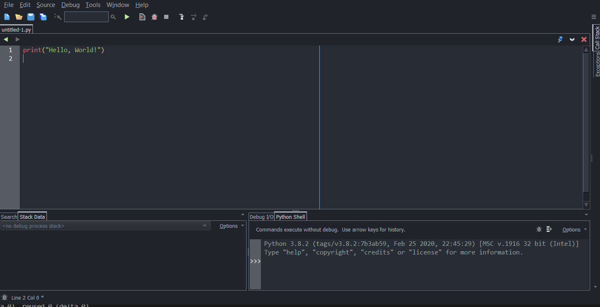

# Lesson 1: Introduction, Variables, and Output

## Table of Contents

  - [Small tour around Wing 101](#small-tour-around-wing-101)
  - [Numbers and Basic Mathematical Operations](#numbers-and-basic-mathematical-operations)
  - [Variables](#variables)
  - [Output](#output)
  - [Exercise](#exercise)


Programming, in its simplest form, is basically providing instructions for a computer to perform a task. We use programming languages such as Python to write code (i.e. these instructions). Sometimes, instructions could be simple, sometimes they could get really complex. If you're new to programming, Python is one of the best starting languages.

## Small tour around Wing 101

So let's start off by taking you through a small exploration of your IDE:

If you followed the setup, you may have ended up with a Wing looking like this:



- The large area where you wrote `print("Hello, World")` is your **Editor** where you write all your code.
  - The thin vertical line in the middle is not "splitting" that area into two windows: it just serves as a guideline telling you that you are encouraged to not have code pass that line. For now you can ignore it.
- The area at the bottom right is called your **interactions window**, which is used to evaluate single Python expressions one-by-one. We will be using that a lot in this course, especially for this first lesson.


## Numbers and Basic Mathematical Operations

Let's start off by learning how to use the interactions window.

We will start by learning how to use numbers and basic mathematical functions: `+` for addition, `-` for subtraction, `*` for multiplication, `/` for division. Type each of these lines below into the interactions window and determine what is returned after each line is entered (Do not type the characters `>>>`, as those are just to tell you to input something in the interactions window. Do not type in the `_____`; just type in the mathematical expression that follows each `>>>`)

```python
>>> 3 + 5
_____
>>> 4 - 2
_____
>>> 4 * 8
_____
>>> 2 * 3 + 5
_____
>>> 2 + 3 * 5
_____
>>> 3 / 2
_____
>>> 2.2 * 3.3
_____
>>> (4 + 1) * 8
_____
```
Notice that the order of operations (BEDMAS) applies when computing these values.

Python also has three more operators:
1. **`x // y`** means "floor division". It calculates the **closest integer below or equal to `x / y`**. It is good to note that if `x` and `y` are positive, `x // y` means `x / y` but **without the remainder**. For example:
    ```python
    >>> 9 / 2
    4.5
    >>> 9 // 2
    4
    >>> -13 / 4
    -3.25
    >>> -13 // 4
    -4
    >>> 4 // 2
    2
    ```
2. **`x % y`**, known as `x` mod `y`, returns the remainder when `x` is divided by `y`. For example:
    ```python
    >>> 9 % 2
    1
    >>> 6 % 3
    0
    ```
3. **`x ** y`** means `x` raised to the exponent of `y`. For example:
    ```python
    >>> 3 ** 2
    9
    >>> 4 ** -2
    0.0625
    ```

## Variables

Of course, sometimes you want to store certain numbers somewhere so you can reuse them for later. Just like in mathematics, Python allows for *variables* for that purpose. You can name your variables something like `a` or `b` or `enoch` or whatever, and assign them a value.

Let's try that out in the interactions window (Note that when you define a variable with a new value, you will not see anything returned)

```python
>>> a = 6
```
Now see the result when you enter each expression below:
```python
>>> a
_____
>>> a * 6
_____
>>> 6 + a
_____
>>> a ** a
_____
>>> 9 * a / 5 + 32
_____
```

You can also create more variables, some can be based on other variables, as well as re-assign values to variables
```python
>>> a = 6
>>> b = a * 2
>>> b
_____
>>> b = a * 3
>>> b
_____
```

Warning: if you want to assign a value to a variable, the variable name itself must be to the left of the equal sign. Therefore, the following expression is invalid:
```python
>>> a + 3 = 6
```

Moreover, when naming a variable, names can only have letters, digits, and the underscore character `_`, and the first character cannot be a digit. Therefore `enoch_poon`, `enOCH11`, `my_var123`, etc. are valid, but not `-a`, `3d`, `r2.d2`, etc. Other **invalid** variable names include Python keywords (which you will learn later in this course) such as `if`, `while`, `for`, `in`, etc. On Wing, a Python keyword will be shown in bold and in a different colour. If that happens, then that means it's an invalid variable name.

**Self-study:** What do you think is going on here?
```python
>>> b = 4
>>> b = b + 6
>>> b
_____
>>> b = 30 * b
>>> b
_____
```

If you understand what's going on up in the above interactions, you can move on to learning these fun shortcuts to modify a variable:

| Shortcut expression | Equivalent expression |
| --| --|
| `a += 5`| `a = a + 5`|
| `a -= 5` | `a = a - 5`|
| `a *= 5` | `a = a * 5` |
| `a /= 5` | `a = a / 5` |
| `a //= 5` | `a = a // 5` |
| `a %= 5` | `a = a % 5`|
| `a **= 5` | `a = a ** 5`|

## Output

**Printing**, in the world of programming, means sending text output to a "console". In Wing 101, the console is actually in your interactions window, but in some environments, it could be somewhere else. For now, we will stick with printing numbers.

This time, we will actually be writing code in the **editor** (Not the interactions window), where you can write and execute several Python expressions at once. Create a new Python file by clicking the blue paper icon at the top left (or Ctrl+N for Windows users, I'm pretty sure it would be Command+N for Mac users. Alternatively, if you still have the line `print("Hello World")` from when you did the setup, you can just get rid of that line instead of creating a new file), and paste the following lines of code in your editor:
```python
a = 3
print(a)
```
Then, save your code somewhere in your computer (preferably create a new folder somewhere you can easily access just for Python code used in this course). Name your file `my_first_code.py` (Note that Python code always have the file extension `.py`).

Next, run this code by clicking the large green Play button at the top. Wing should look somewhat like this (Notice the number 3 is printed in the interactions window as well):


You just used the `print` function, which outputs whatever is passed inside the brackets in one line to the console(values passed inside the brackets are called **arguments**).

**Important note: While before we learned printing, you used the interactions window to *return* a value. However, though they may appear very similar, *printing* a value is *not* the same as *returning* a value. In other words, these two are different:**
```
>>> 3
>>> print(3)
```
**You will understand more of this later.**


**Self-study:** Change your code so it becomes each of these code snippets below. After running each of them, determine what you see in the interactions window (Note that sometimes nothing will be printed, and sometimes an error would be produced):

1. ```python
   a = 3
   print(a)
   ```
2. ```python
   a = 3
   print(a + 50)
   # This is a comment. Comments are just extra text
   # inside code that do nothing when running the code.
   # They always begin with the # character. Comments are
   # useful when you want to remind yourself of what something
   # does in your code
   ```
3. ```python
   a = 3
   print(b) # Comments can also be inline like this
   ```
4. ```python
   a = 3
   print(a)
   print(a + 4)
   print(a * 1)
   ```
5. ```python
   a = 3
   b = a + 400
   print(a)
   a = b
   print(a)
   a += 1
   print(a)
   ```
6. ```python
   a = 3
   b = a + 400
   c = a + b
   ```
7. ```python
   a = 3
   b = a + 400
   print(a)
   print(a + 4, b + 2, 400 + 5000)
   print(b)
   ```
8. ```python
   a = b = c = 100
   print(a, b, c)
   ```


## Exercise

Use the code template below:

```python
radius = 5
pi = 3.14159
area = ______
print(area)
```

Fill in the blank with an *expression* that returns the area of a circle given the `radius`. The result from running the code should be the output:
```
78.53875
```
Note that it must be that if you keep the expression you put for `area` and change the first line to `radius = 6`, if you run the code, your output should be:
```
113.09724
```
And if you change the `radius` to 1, your output should be:
```
3.14159
```
etc.
