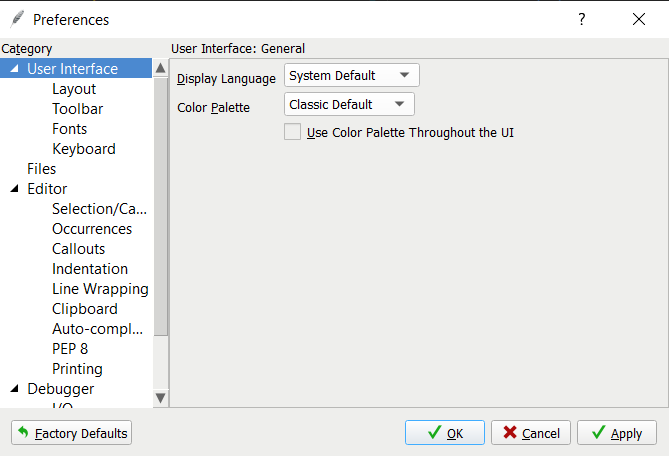

# Introductory Programming in Python
Enoch Poon

## Table of Contents
* [About this course](#about-this-course)
* [Setup](#setup)

## About this course 

- This course is entirely made as an introduction to the field of programming.
- The programming language used throughout the course is **Python 3**
  - please note that **this course is not mainly about learning how to code in Python** (as there are a whole lot of features in the language, we cannot get through so much of it); instead, this course is mainly about **learning how to think like a programmer, using Python as the primary tool.** Therefore, this course would rather be similar to the style of a first-year computer science course.
- Although this course is very beginner-focused, it may not necessarily mean that it is "easy". Becoming a better programmer requires a lot of logical thinking, and puzzle-solving skills. Therefore, if you think you are good at math, there is a higher chance that you can do better in programming. But if you are not so good at math, this course may be more challenging. However, I try my best to accomodate for both slow learners and fast learners.

## Setup

In order to code, you will (of course) require some software installed on your computer. An **integrated development environment (IDE)** is a software used for coding along with many other features in order to aid a programmer. There are many IDE's out there, but if you have no idea which IDE to download, I suggest you use **Wing 101** (see setup links below from University of Waterloo's CS 116 course):

**Warning: the setup guides below will tell you to install Python 3.7.2. Do not do that; instead, install the most recent Python version (e.g. Python 3.8.2 or later). Also, if they mention Dr. Racket, you don't have to know what that is. Just keep reading along.**

- [Setup guide for Windows users](https://www.student.cs.uwaterloo.ca/~cs116/software_install/win_instr)
- [Setup guide for Mac users](https://www.student.cs.uwaterloo.ca/~cs116/software_install/mac_instr)

### Optional Additional Setup

You may or may have not heard of the stereotype that "programmers always use dark theme", meaning whenever programmers use an IDE, they tend to change the colour theme to something darker in order to not burn their eyes as badly. You can optionally do that by following these steps:
1. In Wing 101, Open the menu **Edit -> Preferences**. You should see two dropdown menus titled "Display Language" and "Color Palette", as well as a checkbox labelled "Use Color Palette throughout the UI".

    

2. Ensure that the "Use Color Palette throughout the UI" is checked, if it is not already.
3. Click the "Color Palette" dropdown to see a variety of colour themes you can use. Select whichever one you want, then click "Apply". I highly suggest you use a theme with darker colours such as "Dracula", "One Dark", "Positronic", "Solarized - Dark", etc. You can try them out on your own.
4. Click "OK" to close.

Once you have all that set up, and everything seems to work fine, you can move on to the [first lesson](01_intro/README.md)!
