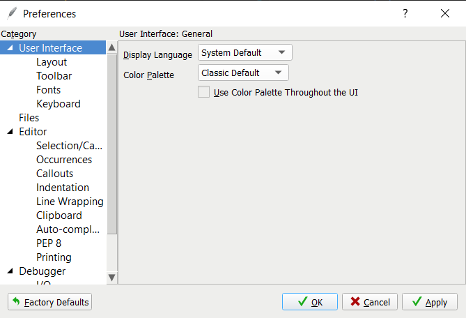
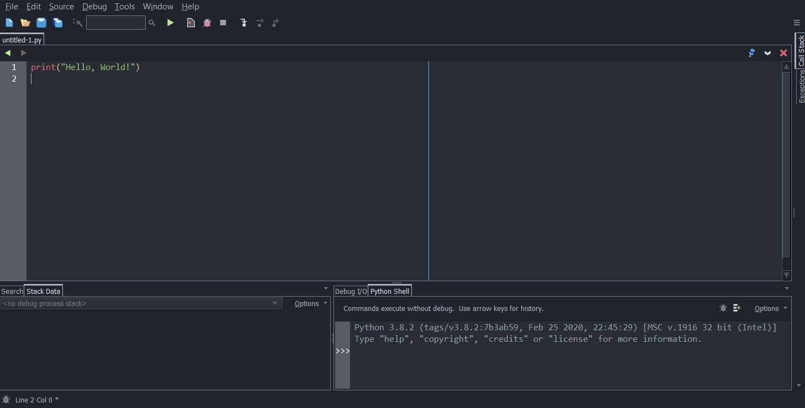

<h1>Introduction and Setup</h1>

<h2>Table of Contents</h2>

- [What is Programming?](#what-is-programming)
- [About this course](#about-this-course)
- [Setup](#setup)
  - [Optional Additional Setup](#optional-additional-setup)
- [Small tour around Wing 101](#small-tour-around-wing-101)

## What is Programming?

Programming, in its simplest form, is basically providing instructions for a computer to perform a task. We use programming languages such as Python to write code (i.e. these instructions). Sometimes writing code can be simple, sometimes it can get really complex. If you're new to programming, Python is one of the best starting languages as it is beginner friendly.

## About this course 

- This course is entirely made as an introduction to the field of programming.
- The programming language used throughout the course is **Python 3**
  - While this course does teach a decent amount about how to code in Python, please note that **this course is rather more focused on learning how to think like a programmer.** Therefore, this course would rather be similar to the style of a first-year computer science course: more academic-style than application-style. However, proficiency in academic-style programming can allow you to learn its many applications as well as other programming languages much more efficiently.
- Although this course is very beginner-focused, it may not necessarily mean that it is "easy". The path to becoming a better programmer requires a lot of logical thinking, and puzzle-solving skills. Therefore, if you think you are good at math, there is a higher chance that you can do better in this course. But if you are not so good at math, this course may be more challenging.
- This course also includes a lot of exercises. Just like learning math, you cannot simply read notes, memorize them, and expect yourself to be a proficient programmer; this skill requires a lot of practice.
  - There have been many cases where students may take several hours, sometimes over the span of days, just to solve a single problem. Stressing yourself too much from programming can be damaging to your health, so be sure you take breaks at certain times.

## Setup

In order to code, you will (of course) require some software installed on your computer. An **integrated development environment (IDE)** is a software used for coding along with many other features in order to aid a programmer. There are many IDE's out there, but if you have no idea which IDE to download, I suggest you use **Wing 101** (see setup links below from University of Waterloo's CS 116 course):

**Warning: the setup guides below will tell you to install Python 3.7.2. Do not do that; instead, install the most recent Python version (e.g. Python 3.8.2 or later). Also, if they mention Dr. Racket, you don't have to know what that is. Just keep reading along.**

- [Setup guide for Windows users](https://www.student.cs.uwaterloo.ca/~cs116/software_install/win_instr)
- [Setup guide for Mac users](https://www.student.cs.uwaterloo.ca/~cs116/software_install/mac_instr)

### Optional Additional Setup

You may or may have not heard of the stereotype that "programmers always use dark theme", meaning whenever programmers use an IDE, they tend to change the colour theme to something darker in order to not burn their eyes as badly. You can optionally do that by following these steps:

1. In Wing 101, Open the menu **Edit -> Preferences**. You should see two dropdown menus titled "Display Language" and "Color Palette", as well as a checkbox labelled "Use Color Palette throughout the UI".
   
   

2. Ensure that the "Use Color Palette throughout the UI" is checked, if it is not already.
3. Click the "Color Palette" dropdown to see a variety of colour themes you can use. Select whichever one you want, then click "Apply". I highly suggest you use a theme with darker colours such as "Dracula", "One Dark", "Positronic", "Solarized - Dark", etc. You can try them out on your own.
4. Click "OK" to close.

## Small tour around Wing 101

So let's start off by taking you through a small exploration of your IDE:

If you followed the setup, you may have ended up with a Wing looking like this:

- The large area where you wrote `print("Hello, World")` is your **Editor** where you write all your code.
  - The thin vertical line in the middle is not "splitting" that area into two windows: it just serves as a guideline telling you that you are encouraged to not have code pass that line. For now you can ignore it.
- The area at the bottom right is called your **Python Shell** (or simply the *shell*), which is used to interactively evaluate single Python expressions one-by-one.

